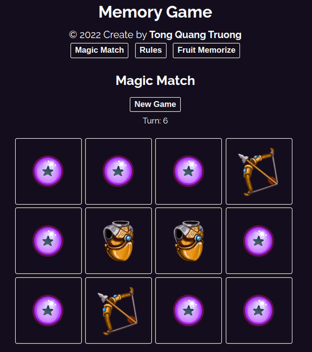
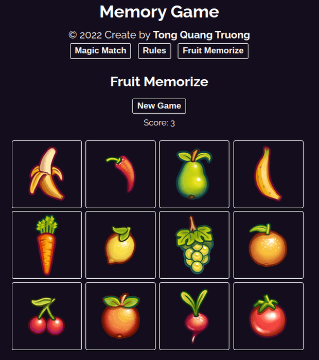

# Memory Games

Train your memory muscles with Match Magic and Fruit Memorize!

##Live Demo

[Live](https://truongwerk.github.io/Memory-games/)

## Screenshots



##



## Features

- Two functional games
- Live previews
- Responsive

## Build With:

- React.
- Css.
- Vite.
- Images from https://opengameart.org/users/ravenmore .

## Run Locally

Clone the project

```bash
  git@github.com:truongwerk/Memory-games.git
```

Install dependencies

```bash
  npm install
```

Start the server

```bash
  npm run dev
```

## License

[MIT](https://choosealicense.com/licenses/mit/)
